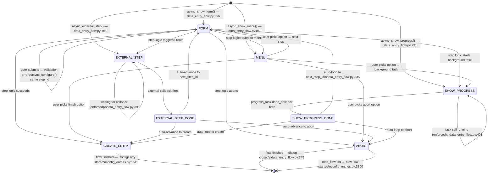

# Home Assistant Core — Complete UI Page Flow Diagram

All transitions are backed by exact file + line-number citations from the
`homeassistant/` source tree.  Every node represents a real UI state
(HTTP view, WebSocket command, FlowResultType, or registered panel);
every edge represents a transition proven by code.

---

```mermaid
flowchart TD
    %% =========================================================
    %% ENTRY
    %% =========================================================
    BROWSER([Browser visits HA])
    BROWSER --> IS_ONBOARDED

    IS_ONBOARDED{"Onboarded?\ncomponents/onboarding/views.py:100\nGET /api/onboarding\nreturns step status list"}
    IS_ONBOARDED -- "Not all 4 steps done" --> ONB_STATUS
    IS_ONBOARDED -- "All steps done" --> AUTH_START

    %% =========================================================
    %% ONBOARDING FLOW
    %% =========================================================
    subgraph ONBOARDING["Onboarding Flow — REST API, no auth required"]
        direction TB

        ONB_STATUS["GET /api/onboarding\nOnboardingStatusView — views.py:100 (class), get:111\nReturns: [{step, done}] for 4 steps\nNo auth: requires_auth = False"]
        ONB_STATUS --> ONB_INSTALLATION

        ONB_INSTALLATION["GET /api/onboarding/installation_type\nInstallationTypeOnboardingView — views.py:118 (class), get:124\nGuard: if any step done → HTTP 401 — views.py:126\nReturns: {installation_type}"]
        ONB_INSTALLATION --> ONB_USER

        ONB_USER["POST /api/onboarding/users  ★ STEP_USER\nUserOnboardingView — views.py:181\nInput: {name, username, password, client_id, language}\nCreates admin user + credentials + person entity\nCreates default areas from translations\nCalls create_auth_code(hass, client_id, credentials)\nReturns: {auth_code}"]
        ONB_USER -- "step already done\nviews.py:187" --> ONB_403A["HTTP 403 abort"]
        ONB_USER -- "Success\nExchange auth_code at /auth/token" --> ONB_CORE_CONFIG

        ONB_CORE_CONFIG["POST /api/onboarding/core_config  ★ STEP_CORE_CONFIG\nCoreConfigOnboardingView — views.py:234\nRequires auth\nFires default integrations:\n  google_translate, met, radio_browser, shopping_list\nEnsures analytics component loaded\nReturns: {}"]
        ONB_CORE_CONFIG -- "step already done\nviews.py:240" --> ONB_403B["HTTP 403 abort"]
        ONB_CORE_CONFIG --> ONB_ANALYTICS

        ONB_ANALYTICS["POST /api/onboarding/analytics  ★ STEP_ANALYTICS\nAnalyticsOnboardingView — views.py:353\nRequires auth\nMarks analytics step done — views.py:363\nReturns: {}"]
        ONB_ANALYTICS -- "step already done" --> ONB_403C["HTTP 403 abort"]
        ONB_ANALYTICS --> ONB_INTEGRATION

        ONB_INTEGRATION["POST /api/onboarding/integration  ★ STEP_INTEGRATION\nIntegrationOnboardingView — views.py:283\nRequires auth\nInput: {client_id, redirect_uri}\nCode order: no-token 403 (L286) → step-done 403 (L292)\n  → mark_done → bad redirect_uri 400 (L303-305)\n  → no-credential 403 (L308-311)\nCalls create_auth_code(hass, client_id, refresh_token.credential)\nReturns: {auth_code}"]
        ONB_INTEGRATION -- "No refresh token/credential → 403\nBad redirect_uri → 400\nStep already done → 403" --> ONB_4XXD["HTTP 4xx abort"]
        ONB_INTEGRATION -- "All 4 steps complete\nviews.py:157" --> ONB_COMPLETE

        ONB_WAIT["POST /api/onboarding/integration/wait\nWaitIntegrationOnboardingView — views.py:335\nInput: {domain}\nReturns: {integration_loaded: bool}"]

        ONB_COMPLETE(["Onboarding complete\nOnboardingData.onboarded = True\nFire all onboarded listeners"])
    end

    ONB_COMPLETE --> AUTH_START

    %% =========================================================
    %% AUTH LOGIN FLOW
    %% =========================================================
    subgraph AUTH_FLOW["Auth Login Flow — components/auth/login_flow.py"]
        direction TB

        AUTH_START["POST /auth/login_flow\nLoginFlowIndexView — login_flow.py:336 (class), post:359\nInput: {client_id, handler=[type,id], redirect_uri, type}\nValidates indieauth client_id\nCalls AuthManagerFlowManager.async_init()\nauth/__init__.py:100"]
        AUTH_START -- "Unknown handler → 404\nInvalid client_id → 400" --> AUTH_ERR(["HTTP error"])
        AUTH_START --> AUTH_PROV_DISPATCH

        AUTH_PROV_DISPATCH{"Which auth provider?\nauth/__init__.py:100"}

        AUTH_PROV_DISPATCH -- "homeassistant" --> HA_INIT
        AUTH_PROV_DISPATCH -- "trusted_networks" --> TN_INIT
        AUTH_PROV_DISPATCH -- "command_line" --> CL_INIT
        AUTH_PROV_DISPATCH -- "insecure_example" --> IE_INIT

        subgraph HA_PROVIDER["homeassistant provider — providers/homeassistant.py:409"]
            HA_INIT["async_step_init — homeassistant.py:412\nShow form: {username, password}"]
            HA_INIT -- "InvalidAuth\nerrors.base=invalid_auth — homeassistant.py:424" --> HA_INIT
            HA_INIT -- "Valid credentials\nbcrypt check in thread" --> HA_FINISH
            HA_FINISH["async_finish()\nStrips password field\nasync_create_entry(data={username})\nproviders/__init__.py:302"]
        end

        subgraph TN_PROVIDER["trusted_networks provider — providers/trusted_networks.py:235"]
            TN_INIT["async_step_init\nValidate IP in trusted network\ntrusted_networks.py:235"]
            TN_INIT -- "Not in trusted network\ntrusted_networks.py:243" --> TN_ABORT_NOT(["async_abort(reason=not_allowed)"])
            TN_INIT -- "allow_bypass_login + only 1 user\ntrusted_networks.py:248" --> TN_AUTO
            TN_INIT -- "Multiple available users" --> TN_FORM
            TN_FORM["Show form: {user: vol.In(available_users)}\ntrusted_networks.py:253"]
            TN_FORM -- "User selected" --> TN_AUTO
            TN_AUTO["Auto-complete: async_finish({user_id})\nsupport_mfa = False → MFA skipped\ntrusted_networks.py:103"]
        end

        subgraph CL_PROVIDER["command_line provider — providers/command_line.py:141"]
            CL_INIT["async_step_init\nShow form: {username, password}\ncommand_line.py:160"]
            CL_INIT -- "InvalidAuthError\nerrors.base=invalid_auth" --> CL_INIT
            CL_INIT -- "Valid (subprocess call)" --> CL_FINISH
            CL_FINISH["async_finish()\nStrips password field\nasync_create_entry({username})\nproviders/__init__.py:302"]
        end

        subgraph IE_PROVIDER["insecure_example provider — providers/insecure_example.py:100"]
            IE_INIT["async_step_init\nShow form: {username, password}\ninsecure_example.py:118"]
            IE_INIT -- "InvalidAuthError\nerrors.base=invalid_auth" --> IE_INIT
            IE_INIT -- "Valid (hmac compare)" --> IE_FINISH
            IE_FINISH["async_finish()\nStrips password field\nasync_create_entry({username})"]
        end

        HA_FINISH --> MFA_GATE
        CL_FINISH --> MFA_GATE
        IE_FINISH --> MFA_GATE
        TN_AUTO --> AUTH_COMPLETE_NODE

        MFA_GATE{"MFA enabled?\nsupport_mfa=True\n& user has MFA modules\nauth/__init__.py:168"}
        MFA_GATE -- "No MFA configured" --> AUTH_COMPLETE_NODE

        subgraph MFA_LOGIN_SUBFLOW["MFA Login Verification — providers/__init__.py:223"]
            MFA_SEL["async_step_select_mfa_module\nproviders/__init__.py:223\nShow form: {multi_factor_auth_module}\n(auto-skipped if only 1 module)"]
            MFA_SEL -- "Invalid module\nerrors.base=invalid_auth_module" --> MFA_SEL
            MFA_SEL -- "Module selected" --> MFA_VERIFY

            MFA_VERIFY["async_step_mfa\nproviders/__init__.py:248\nShow form: data_schema = auth_module.input_schema\n(notify module: sends OTP first via async_initialize_login_mfa_step)"]
            MFA_VERIFY -- "Session expired\nproviders/__init__.py:276" --> MFA_LOGIN_EXPIRED(["async_abort(reason=login_expired)"])
            MFA_VERIFY -- "Invalid code\nincrement invalid_mfa_times\nproviders/__init__.py:281" --> MFA_RETRY_CHECK
            MFA_RETRY_CHECK{"retries < MAX_RETRY_TIME?\nproviders/__init__.py:283"}
            MFA_RETRY_CHECK -- "YES" --> MFA_VERIFY
            MFA_RETRY_CHECK -- "NO (MAX_RETRY_TIME > 0)" --> MFA_TOO_MANY(["async_abort(reason=too_many_retry)"])
            MFA_VERIFY -- "Valid code" --> MFA_OK
            MFA_OK["async_create_entry — Authenticated\nCredentials passed to flow manager"]
        end

        MFA_GATE -- "Has MFA modules" --> MFA_SEL
        MFA_OK --> AUTH_COMPLETE_NODE

        AUTH_COMPLETE_NODE["CREATE_ENTRY — credentials stored\nauth_code minted via store_result()\n_async_flow_result_to_response — login_flow.py:285\nClient exchanges auth_code at POST /auth/token\n→ receives access_token + refresh_token"]
    end

    HA_INIT & TN_INIT & CL_INIT & IE_INIT -.->|"POST /auth/login_flow/{flow_id}\nLoginFlowResourceView\nIP validation: must match original"| AUTH_PROV_DISPATCH

    AUTH_COMPLETE_NODE --> SIDEBAR_ENTRY

    %% =========================================================
    %% MAIN APP — SIDEBAR NAVIGATION
    %% =========================================================
    subgraph MAIN_NAV["Main App — Sidebar Navigation (registered panels)"]
        direction LR

        SIDEBAR_ENTRY(["Authenticated App Shell"])

        SIDEBAR_ENTRY --> P_LOVELACE
        SIDEBAR_ENTRY --> P_ENERGY
        SIDEBAR_ENTRY --> P_HISTORY
        SIDEBAR_ENTRY --> P_LOGBOOK
        SIDEBAR_ENTRY --> P_TODO
        SIDEBAR_ENTRY --> P_MEDIA
        SIDEBAR_ENTRY --> P_CALENDAR
        SIDEBAR_ENTRY --> P_MAP
        SIDEBAR_ENTRY --> P_CONFIG
        SIDEBAR_ENTRY --> P_PROFILE
        SIDEBAR_ENTRY --> P_APP

        P_LOVELACE["/ — Overview / Lovelace\ncomponent=lovelace (builtin)\ncomponents/lovelace/__init__.py:345\nDynamic url_path per dashboard"]
        P_ENERGY["/energy\ncomponent=energy\ncomponents/energy/__init__.py:29\nmdi:lightning-bolt"]
        P_HISTORY["/history\ncomponent=history\ncomponents/history/__init__.py:49\nmdi:chart-box"]
        P_LOGBOOK["/logbook\ncomponent=logbook\ncomponents/logbook/__init__.py:117\nmdi:format-list-bulleted-type"]
        P_TODO["/todo\ncomponent=todo\ncomponents/todo/__init__.py:127\nmdi:clipboard-list"]
        P_MEDIA["/media-browser\ncomponent=media-browser\ncomponents/media_source/http.py:27\nmdi:play-box-multiple"]
        P_CALENDAR["/calendar\ncomponent=calendar\ncomponents/calendar/__init__.py:321\nmdi:calendar"]
        P_MAP["/map — Lovelace map dashboard\ncomponents/lovelace/__init__.py:366\n_create_map_dashboard()"]
        P_CONFIG["/config  (admin required)\ncomponent=config\ncomponents/config/__init__.py:51\nmdi:cog"]
        P_PROFILE["/profile\ncomponent=profile\ncomponents/frontend/__init__.py:603\n(no sidebar)"]
        P_APP["/app — Supervisor shell\ncomponent=app\ncomponents/hassio/__init__.py:211"]

        subgraph HIDDEN_PANELS["Hidden / No-sidebar panels\ncomponents/frontend/__init__.py"]
            P_LIGHT["/light — L574"]
            P_SECURITY["/security — L581"]
            P_CLIMATE["/climate — L588"]
            P_HOME["/home — L595"]
            P_NOTFOUND["/notfound — 404 fallback — L604"]
        end

        subgraph CUSTOM_PANELS["Custom / Integration panels\n(component=custom via panel_custom)"]
            P_HASSIO["/hassio  admin\nhassio-main iframe\ncomponents/hassio/__init__.py:264"]
            P_KNX["/knx  admin\nknx_frontend package\ncomponents/knx/websocket.py:88"]
            P_DYNALITE["/dynalite  admin\ndynalite-panel iframe\ncomponents/dynalite/panel.py:108"]
            P_INSTEON["/insteon  admin\ninsteon-frontend iframe\ncomponents/insteon/api/__init__.py:105"]
            P_LCN["/lcn  admin\nlcn_frontend package\ncomponents/lcn/websocket.py:89"]
            P_ADDON["/{addon_slug}  ingress panels\ncomponent=app\ncomponents/hassio/addon_panel.py:75"]
        end
    end

    P_CONFIG --> CFG_ROOT

    %% =========================================================
    %% /config PANEL — SUB-PAGES (pure frontend routes)
    %% =========================================================
    subgraph CONFIG_PANEL["/config Panel — Sub-pages (frontend routes, Python = API only)"]
        direction TB

        CFG_ROOT["/config"]
        CFG_ROOT --> CFG_INTEGRATIONS
        CFG_ROOT --> CFG_DEVICES
        CFG_ROOT --> CFG_ENTITIES
        CFG_ROOT --> CFG_AREAS
        CFG_ROOT --> CFG_FLOORS
        CFG_ROOT --> CFG_AUTO
        CFG_ROOT --> CFG_SCRIPT
        CFG_ROOT --> CFG_SCENE
        CFG_ROOT --> CFG_HELPERS
        CFG_ROOT --> CFG_USERS
        CFG_ROOT --> CFG_GENERAL
        CFG_ROOT --> CFG_DASH
        CFG_ROOT --> CFG_REPAIRS
        CFG_ROOT --> CFG_DEVTOOLS

        CFG_INTEGRATIONS["/config/integrations\nHTTP: POST /api/config/config_entries/flow\nHTTP: /api/config/config_entries/options/flow\nHTTP: /api/config/config_entries/subentries/flow\nconfig/config_entries.py:168,263,299"]
        CFG_DEVICES["/config/devices\nWS: config/device_registry/list,update,\n    remove_config_entry\nconfig/device_registry.py:19"]
        CFG_ENTITIES["/config/entities\nWS: config/entity_registry/list,get,\n    update,remove,get_entities\nconfig/entity_registry.py:25"]
        CFG_AREAS["/config/areas\nWS: config/area_registry/list,create,\n    delete,update,reorder\nconfig/area_registry.py:15"]
        CFG_FLOORS["/config/floors\nWS: config/floor_registry/list,create,\n    delete,update,reorder\nconfig/floor_registry.py:15"]
        CFG_AUTO["/config/automation\nHTTP: GET|POST|DELETE\n/api/config/automation/config/{key}\nconfig/automation.py:44"]
        CFG_SCRIPT["/config/script\nHTTP: GET|POST|DELETE\n/api/config/script/config/{key}\nconfig/script.py:21"]
        CFG_SCENE["/config/scene\nHTTP: GET|POST|DELETE\n/api/config/scene/config/{key}\nconfig/scene.py:24"]
        CFG_HELPERS["/config/helpers\n→ integration config flows\n   (helper integrations)"]
        CFG_USERS["/config/users  admin\nWS: config/auth/list,create,\n    update,delete\nWS: config/auth_provider/homeassistant/*\nconfig/auth.py + auth_provider_homeassistant.py"]
        CFG_GENERAL["/config/general\nWS: config/core/update\n    (country,currency,elevation,lat,lon,tz)\nWS: config/core/detect\nconfig/core.py:20"]
        CFG_DASH["/config/lovelace/dashboards\nManage Lovelace dashboard list"]
        CFG_REPAIRS["/config/repairs\nHTTP: POST /api/repairs/issues/fix\nWS: repairs/list_issues\nWS: repairs/ignore_issue\nrepairs/websocket_api.py"]

        CFG_DEVTOOLS["/config/developer-tools\nRedirected from /developer-tools/*\ncomponents/frontend/__init__.py:558-570"]
        CFG_DEVTOOLS --> DT_STATE["/config/developer-tools/state"]
        CFG_DEVTOOLS --> DT_ACTION["/config/developer-tools/action"]
        CFG_DEVTOOLS --> DT_TEMPLATE["/config/developer-tools/template"]
        CFG_DEVTOOLS --> DT_EVENT["/config/developer-tools/event"]
        CFG_DEVTOOLS --> DT_STATS["/config/developer-tools/statistics"]
        CFG_DEVTOOLS --> DT_ASSIST["/config/developer-tools/assist"]
        CFG_DEVTOOLS --> DT_YAML["/config/developer-tools/yaml"]
        CFG_DEVTOOLS --> DT_DEBUG["/config/developer-tools/debug"]
    end

    CFG_INTEGRATIONS --> CF_INIT
    CFG_INTEGRATIONS -.->|"options" | OPT_INIT
    CFG_INTEGRATIONS -.->|"subentries"| SUB_INIT
    CFG_REPAIRS --> REP_INIT
    CFG_USERS --> UM_LIST

    %% =========================================================
    %% CONFIG FLOW FRAMEWORK
    %% =========================================================
    subgraph CONFIG_FLOW["Config Flow Framework\ndata_entry_flow.py + config_entries.py"]
        direction TB

        CF_INIT["POST /api/config/config_entries/flow\nconfig/config_entries.py:168\nConfigEntriesFlowManager.async_init(domain)\nValidates source in context — config_entries.py:1463\nGuard: reauth/reconfigure require entry_id — L1466\nGuard: single_instance_allowed — L1493\ninit_step = context.source\ne.g. 'user', 'bluetooth', 'dhcp', 'homekit',\n     'mqtt', 'ssdp', 'usb', 'zeroconf', 'hassio',\n     'integration_discovery', 'reauth', 'reconfigure'"]

        CF_INIT --> CF_SOURCE_DISPATCH

        CF_SOURCE_DISPATCH{"init_step = context.source\nconfig_entries.py:1793"}

        CF_SOURCE_DISPATCH -- "source=user" --> CF_STEP_USER
        CF_SOURCE_DISPATCH -- "source=bluetooth/dhcp/homekit\n  mqtt/ssdp/usb/zeroconf\n  hassio/integration_discovery" --> CF_STEP_DISCOVERY
        CF_SOURCE_DISPATCH -- "source=reauth\n(entry_id required)" --> CF_STEP_REAUTH
        CF_SOURCE_DISPATCH -- "source=reconfigure\n(entry_id required)" --> CF_STEP_RECONFIGURE

        CF_STEP_USER["async_step_user(init_data)\nIntegration-defined\n(default: async_abort(reason=not_implemented)\nconfig_entries.py:3186)"]
        CF_STEP_DISCOVERY["async_step_{source}(discovery_info)\nDefault delegates to\n_async_step_discovery_without_unique_id()\n→ async_step_user()\nconfig_entries.py:3226-3282"]
        CF_STEP_REAUTH["async_step_reauth(entry_data)\nIntegration-defined\nHelper: _get_reauth_entry()\nconfig_entries.py:3507"]
        CF_STEP_RECONFIGURE["async_step_reconfigure(user_input)\nIntegration-defined\nHelper: _get_reconfigure_entry()\nconfig_entries.py:3519"]

        CF_STEP_USER --> CF_RES_DISPATCH
        CF_STEP_DISCOVERY --> CF_RES_DISPATCH
        CF_STEP_REAUTH --> CF_RES_DISPATCH
        CF_STEP_RECONFIGURE --> CF_RES_DISPATCH

        CF_RES_DISPATCH{"FlowResultType\ndata_entry_flow.py:28"}

        CF_RES_DISPATCH -- "FORM" --> CF_FORM
        CF_RES_DISPATCH -- "MENU" --> CF_MENU
        CF_RES_DISPATCH -- "EXTERNAL_STEP" --> CF_EXT
        CF_RES_DISPATCH -- "SHOW_PROGRESS" --> CF_PROG
        CF_RES_DISPATCH -- "CREATE_ENTRY" --> CF_CREATE
        CF_RES_DISPATCH -- "ABORT" --> CF_ABORT

        CF_FORM["FORM — async_show_form()\ndata_entry_flow.py:696\nRender data_schema as UI form\nShow errors dict (field → i18n key)\nlast_step: bool — Submit vs Next button\npreview: str — optional preview component"]
        CF_FORM -- "POST /api/config/config_entries/flow/{id}\nasync_configure(flow_id, user_input)\nvalidated against data_schema\ndata_entry_flow.py:357" --> CF_RES_DISPATCH

        CF_MENU["MENU — async_show_menu()\ndata_entry_flow.py:860\nShow labelled list of next-step choices\nmenu_options: list of step IDs\nsort: bool (alphabetical order)"]
        CF_MENU -- "user_input={next_step_id: X}\ndata_entry_flow.py:378-381" --> CF_RES_DISPATCH

        CF_EXT["EXTERNAL_STEP — async_external_step()\ndata_entry_flow.py:761\nOpen URL in browser (OAuth / external auth)\nNext result MUST be EXTERNAL_STEP\n  or EXTERNAL_STEP_DONE — enforced\ndata_entry_flow.py:391-400"]
        CF_EXT -- "External callback fires\nasync_configure() called by OAuth handler" --> CF_EXT_DONE
        CF_EXT_DONE["EXTERNAL_STEP_DONE — async_external_step_done()\ndata_entry_flow.py:781\nAuto-advance to next_step_id\nNo user interaction needed"]
        CF_EXT_DONE --> CF_RES_DISPATCH

        CF_PROG["SHOW_PROGRESS — async_show_progress()\ndata_entry_flow.py:791\nShow progress indicator\nprogress_action: i18n description key\nprogress_task: asyncio.Task\nNext result MUST be SHOW_PROGRESS\n  or SHOW_PROGRESS_DONE — enforced\ndata_entry_flow.py:401-409\nasync_update_progress(float) fires\nEVENT_DATA_ENTRY_FLOW_PROGRESS_UPDATE — L831"]
        CF_PROG -- "progress_task.done_callback\n→ schedule async_configure()\ndata_entry_flow.py:512-528" --> CF_PROG_DONE
        CF_PROG_DONE["SHOW_PROGRESS_DONE — async_show_progress_done()\ndata_entry_flow.py:850\nAuto-loop: manager advances immediately\ndata_entry_flow.py:335\nNo user interaction needed"]
        CF_PROG_DONE --> CF_RES_DISPATCH

        CF_CREATE["CREATE_ENTRY — terminal success\nConfigEntriesFlowManager.async_finish_flow\nconfig_entries.py:1611\nConfigEntry created and stored\nIntegration set up\n(blocked if source=reauth or reconfigure\nconfig_entries.py:3316)"]
        CF_ABORT["ABORT — terminal failure\nasync_abort(reason, description_placeholders)\ndata_entry_flow.py:745\nAbort reason displayed then dialog closed\nFlow removed from _progress\nAbortFlow exception auto-converted — L484"]
        CF_ABORT -- "next_flow: tuple[FlowType, str] set\nconfig_entries.py:3300" --> CF_INIT

        CF_CREATE --> CF_OPTS_AVAILABLE

        CF_OPTS_AVAILABLE{"Options flow available?\nasync_supports_options_flow()\nconfig_entries.py:2962\n(True iff subclass overrides\nasync_get_options_flow)"}

        CF_SPECIAL["Special abort helpers:\n_abort_if_unique_id_configured — L3037\n_abort_if_unique_id_mismatch — L3016\n_async_abort_entries_match — L2998\nasync_set_unique_id → abort dup flows — L3086\nasync_update_and_abort — L3378\nasync_update_reload_and_abort — L3420"]

        CF_STEP_DISCOVERY -- "async_step_ignore()\nCreates SOURCE_IGNORE entry\nconfig_entries.py:3168" --> CF_IGNORE(["Source ignored"])
    end

    %% =========================================================
    %% OPTIONS FLOW
    %% =========================================================
    subgraph OPTIONS_FLOW["Options Flow — config_entries.py:3770"]
        direction TB

        OPT_INIT["POST /api/config/config_entries/options/flow\nconfig/config_entries.py:263  @require_admin POLICY_EDIT\nOptionsFlowManager.async_init(entry_id)\ncalls handler.async_get_options_flow(entry)\nconfig_entries.py:3778"]
        OPT_INIT --> OPT_STEP_INIT

        OPT_STEP_INIT["async_step_init (integration-defined)\nTypically async_show_form(step_id='init')"]
        OPT_STEP_INIT -- "POST /api/config/config_entries/options/flow/{id}\nuser_input submitted" --> OPT_MORE_STEPS
        OPT_MORE_STEPS["...additional integration-defined steps...\n(FORM / MENU / EXTERNAL_STEP / SHOW_PROGRESS)"]
        OPT_MORE_STEPS --> OPT_DONE

        OPT_DONE["CREATE_ENTRY — OptionsFlowManager.async_finish_flow\nconfig_entries.py:3793\nasync_update_entry(entry, options=result.data)\n[OptionsFlowWithReload]\n  automatic_reload=True → async_schedule_reload()\nconfig_entries.py:3828"]
    end

    CF_OPTS_AVAILABLE -- "User opens options gear icon" --> OPT_INIT

    %% =========================================================
    %% SUBENTRY FLOW
    %% =========================================================
    subgraph SUBENTRY_FLOW["Config Subentry Flow — config_entries.py:3536"]
        direction TB

        SUB_INIT["POST /api/config/config_entries/subentries/flow\nconfig/config_entries.py:299  @require_admin\nConfigSubentryFlowManager.async_init\nhandler = (entry_id, subentry_type)\nLooks up subentry_types via\nhandler.async_get_supported_subentry_types(entry)\nconfig_entries.py:3546"]
        SUB_INIT --> SUB_SOURCE

        SUB_SOURCE{"context.source\nconfig_entries.py:3546"}
        SUB_SOURCE -- "SOURCE_USER" --> SUB_STEP_USER
        SUB_SOURCE -- "SOURCE_RECONFIGURE\n(subentry_id in context)" --> SUB_STEP_RECONFIG

        SUB_STEP_USER["async_step_user (integration-defined)\nCreate new subentry\nasync_create_entry(title, data, unique_id)\nconfig_entries.py:3621\nNote: raises ValueError if source != SOURCE_USER"]
        SUB_STEP_RECONFIG["async_step_reconfigure (integration-defined)\nEdit existing subentry\n_get_reconfigure_subentry()\nconfig_entries.py:3761"]

        SUB_STEP_USER -- "CREATE_ENTRY" --> SUB_CREATE
        SUB_STEP_RECONFIG -- "async_update_and_abort()\nconfig_entries.py:3674" --> SUB_UPDATE_ABORT(["Subentry updated\nasync_update_reload_and_abort if reload needed\nconfig_entries.py:3703"])
        SUB_STEP_USER & SUB_STEP_RECONFIG -- "FORM/MENU/PROGRESS\n(same as ConfigFlow framework)" --> SUB_STEP_USER

        SUB_CREATE["CREATE_ENTRY\nConfigSubentryFlowManager.async_finish_flow\nconfig_entries.py:3572\nasync_add_subentry(entry, ConfigSubentry(\n  data, subentry_type, title, unique_id))"]
    end

    %% =========================================================
    %% REPAIRS FLOW
    %% =========================================================
    subgraph REPAIRS_FLOW["Repairs Flow — components/repairs/"]
        direction TB

        REP_INIT["POST /api/repairs/issues/fix\nRepairsFlowIndexView — websocket_api.py:110  @require_admin\nRepairsFlowManager.async_init(domain, {issue_id})\nLooks up issue in IssueRegistry\nissue_handler.py:52"]
        REP_INIT --> REP_IS_FIXABLE

        REP_IS_FIXABLE{"issue.is_fixable?\n& platform available?"}
        REP_IS_FIXABLE -- "Not fixable → UnknownHandler" --> REP_ERR(["Flow manager raises error"])
        REP_IS_FIXABLE -- "Custom platform" --> REP_CUSTOM
        REP_IS_FIXABLE -- "Built-in (no platform)" --> REP_CONFIRM_INIT

        REP_CUSTOM["platform.async_create_fix_flow(hass, issue_id, data)\nissue_handler.py:52\nIssue-specific multi-step repair flow\nMay use FORM/MENU/PROGRESS states"]
        REP_CONFIRM_INIT["ConfirmRepairFlow.async_step_init()\nissue_handler.py:24\nDelegates to async_step_confirm()"]
        REP_CONFIRM_INIT --> REP_CONFIRM

        REP_CONFIRM["async_step_confirm(user_input)\nissue_handler.py:30\nShow confirm form (with issue translation_placeholders)\nOn non-None user_input → async_create_entry(data={})"]
        REP_CONFIRM -- "POST /api/repairs/issues/fix/{flow_id}\nuser confirms (empty user_input)" --> REP_DONE
        REP_CUSTOM --> REP_DONE

        REP_DONE["CREATE_ENTRY\nRepairsFlowManager.async_finish_flow()\nissue_handler.py:82\nir.async_delete_issue() → issue removed from registry"]

        REP_WS["WebSocket helpers:\nrepairs/list_issues — websocket_api.py:84\nrepairs/ignore_issue — websocket_api.py:69\nrepairs/get_issue_data — websocket_api.py:45"]
    end

    %% =========================================================
    %% MFA SETUP FLOW
    %% =========================================================
    subgraph MFA_SETUP["MFA Module Setup Flow — components/auth/mfa_setup_flow.py"]
        direction TB

        MFAS_ENTRYPOINT["WS: auth/setup_mfa\nmfa_setup_flow.py:87 (websocket_setup_mfa)\nGuard: module must exist — mfa_setup_flow.py:104\nMfaFlowManager.async_init(mfa_module_id, {user_id}) — L112\nContinued via flow_id: flow_manager.async_configure() — L97"]
        MFAS_ENTRYPOINT --> MFAS_MOD_DISPATCH

        MFAS_MOD_DISPATCH{"Which MFA module?"}

        subgraph TOTP_SETUP["TOTP Setup — auth/mfa_modules/totp.py:180"]
            TOTP_INIT["async_step_init — totp.py:194\nGenerate (ota_secret, url, qr_image)\n  via _generate_secret_and_qr_code() in executor\nShow form: {code: str}\nwith QR code + url placeholders"]
            TOTP_INIT -- "pyotp.TOTP.verify() fails\nerrors.base=invalid_code\ntotp.py:216" --> TOTP_INIT
            TOTP_INIT -- "Valid TOTP code confirmed" --> TOTP_DONE
            TOTP_DONE["async_create_entry(data={result: ota_secret})\ntotp.py:214\nasync_setup_user(user_id, {secret: ota_secret})"]
        end

        subgraph NOTIFY_SETUP["Notify MFA Setup — auth/mfa_modules/notify.py:270"]
            NOTIF_INIT["async_step_init (user_input=None)\nCheck available notify services\nnotify.py:304"]
            NOTIF_INIT -- "No services available\nnotify.py:304" --> NOTIF_ABORT(["async_abort(reason=no_available_service)"])
            NOTIF_INIT -- "Services exist\nShow form: {notify_service, target?}\nnotify.py:313" --> NOTIF_SVC_FORM
            NOTIF_SVC_FORM -- "Service selected" --> NOTIF_STEP_SETUP

            NOTIF_STEP_SETUP["async_step_setup\nGenerate OTP from _secret/_count\nSend OTP via async_notify()\nShow form: {code: str}\nnotify.py:315"]
            NOTIF_STEP_SETUP -- "ServiceNotFound\nnotify.py:347" --> NOTIF_SVC_ABORT(["async_abort(reason=notify_service_not_exist)"])
            NOTIF_STEP_SETUP -- "Wrong code, send new OTP\nerrors.base=invalid_code\nnotify.py:349" --> NOTIF_STEP_SETUP
            NOTIF_STEP_SETUP -- "Correct code" --> NOTIF_DONE
            NOTIF_DONE["async_create_entry(data={})\nnotify.py:332\nasync_setup_user(user_id, {notify_service, target})"]
        end

        MFAS_MOD_DISPATCH -- "totp" --> TOTP_INIT
        MFAS_MOD_DISPATCH -- "notify" --> NOTIF_INIT

        MFAS_DISABLE["WS: auth/depose_mfa\nmfa_setup_flow.py:125\nhass.auth.async_disable_user_mfa(user, module_id)"]
    end

    P_PROFILE -.->|"MFA settings section" | MFAS_ENTRYPOINT

    %% =========================================================
    %% USER MANAGEMENT (WS commands, no FlowHandler)
    %% =========================================================
    subgraph USER_MGMT["User Management — Direct WS (no FlowHandler)"]
        direction LR

        UM_LIST["WS: config/auth/list\nauth.py — list all users"]
        UM_CREATE_1["Step 1: WS config/auth/create\nauth.py:88\nhass.auth.async_create_user(name, group_ids, local_only)\nReturns {user}"]
        UM_CREATE_2["Step 2: WS config/auth_provider/homeassistant/create\nauth_provider_homeassistant.py:37\nprovider.async_add_auth(username, password)\nprovider.async_get_or_create_credentials({username})\nhass.auth.async_link_user(user, credentials)"]
        UM_CREATE_1 --> UM_CREATE_2
        UM_UPDATE["WS: config/auth/update\nauth.py:115\nhass.auth.async_update_user()\nFields: name, is_active, group_ids, local_only\nGuard: cannot deactivate owner"]
        UM_DELETE["WS: config/auth/delete\nauth.py:53\nhass.auth.async_remove_user(user)"]
        UM_CHPW["WS: config/auth_provider/homeassistant/change_password\nUser changes own password"]
        UM_ADMINPW["WS: config/auth_provider/homeassistant/admin_change_password\nAdmin changes any user password  @require_admin"]
        UM_ADMINUN["WS: config/auth_provider/homeassistant/admin_change_username\nAdmin changes any user username  @require_admin"]
    end

    %% =========================================================
    %% HTTP REDIRECTS
    %% =========================================================
    subgraph HTTP_REDIRECTS["HTTP Redirects — components/frontend/__init__.py"]
        R1["/.well-known/change-password → /profile\nfrontend/__init__.py:546  HTTP 302"]
        R2["/shopping-list → /todo\nfrontend/__init__.py:556"]
        R3["/developer-tools → /config/developer-tools\nfrontend/__init__.py:559"]
        R3b["/developer-tools/yaml → /config/developer-tools/yaml"]
        R3c["/developer-tools/state → /config/developer-tools/state"]
        R3d["/developer-tools/action → /config/developer-tools/action"]
        R3e["/developer-tools/template → /config/developer-tools/template"]
        R3f["/developer-tools/event → /config/developer-tools/event"]
        R3g["/developer-tools/statistics → /config/developer-tools/statistics"]
        R3h["/developer-tools/assist → /config/developer-tools/assist"]
        R3i["/developer-tools/debug → /config/developer-tools/debug"]
        R3 --> R3b & R3c & R3d & R3e & R3f & R3g & R3h & R3i
    end

    R1 -.-> P_PROFILE
    R2 -.-> P_TODO
    R3 -.-> CFG_DEVTOOLS

    %% =========================================================
    %% _my_redirect PANEL
    %% =========================================================
    P_MY_REDIRECT["/_my_redirect\ncomponent=my\ncomponents/my/__init__.py:16\nRoutes deep-links from my.home-assistant.io\nMap of logical targets to /config/* pages"]
    SIDEBAR_ENTRY -.-> P_MY_REDIRECT
```

---

## Flow Summary

| Flow | Entry Point | Terminal States | Key File(s) |
|---|---|---|---|
| Onboarding | `GET /api/onboarding` | All 4 steps done | `components/onboarding/views.py` |
| Auth Login | `POST /auth/login_flow` | `CREATE_ENTRY` (auth_code), `ABORT` | `components/auth/login_flow.py`, `auth/providers/` |
| MFA Login | Automatic after provider finish | `CREATE_ENTRY`, `ABORT` (expired/too_many) | `auth/providers/__init__.py` |
| Config Flow | `POST /api/config/config_entries/flow` | `CREATE_ENTRY` (ConfigEntry), `ABORT` | `data_entry_flow.py`, `config_entries.py` |
| Options Flow | `POST /api/config/config_entries/options/flow` | `CREATE_ENTRY` (options updated) | `config_entries.py:3770` |
| Subentry Flow | `POST /api/config/config_entries/subentries/flow` | `CREATE_ENTRY` / `async_update_and_abort` | `config_entries.py:3536` |
| Repairs Flow | `POST /api/repairs/issues/fix` | `CREATE_ENTRY` (issue deleted) | `components/repairs/` |
| MFA Setup | `WS: auth/setup_mfa` | `CREATE_ENTRY` (module enabled) | `components/auth/mfa_setup_flow.py` |
| User Mgmt | `WS: config/auth/create` | n/a (direct WS) | `components/config/auth.py` |

## FlowResultType State Machine


